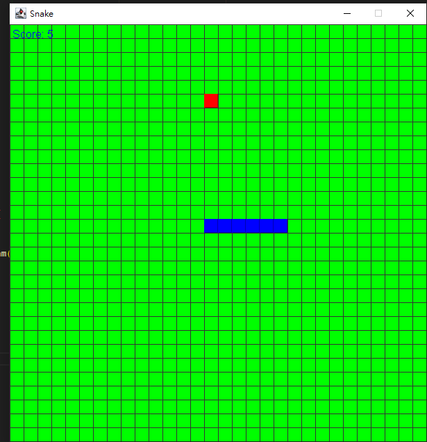

# COMP223-222
## Final project

# **Snake Game**
This is a classic snake game where players need to control a snake to move around the screen, eat food and avoid hitting walls or their own body. The game is mainly developed using Python language.



## __motivation:__
We main motivation for creating this Snake game is to show beginners how to use the Python language to develop a simple and fun game. This game helps beginners understand basic game development concepts such as game loops, graphics drawing, and user input handling.

## __Why did our create this project?__
We hope this project can be a starting point for beginners to learn Python game development. Through this game, they can learn how to handle game logic, collision detection, game state management, and more. I believe that by actually developing a simple game, beginners can better understand and apply what they have learned.

## __What did you learn through your project experience?__
Through this project, We learned how to use Python language for game development. We became familiar with the concept of game loops and learned to handle common game development tasks such as user input, graphics drawing, collision detection, etc. Additionally, We solidified my programming skills and learned how to organize code, manage projects, and debug.

## __What makes your project stand out?__
What makes this Snake game stand out is its simplicity and ease of understanding. It uses concise code to implement basic game logic, suitable for beginners to learn and modify. Additionally, the documentation and comments for this project are very clear, making it easy for beginners to understand and follow.

# **__How to play__**
run game:

python snake_game.py
Use the arrow keys on your keyboard to control the direction of the snake's movement:

Up arrow: move up
Down arrow: move down
Left Arrow: Move left
Right arrow: move right
Try to eat as much food as possible. Every time you eat a piece of food, the snake's body will become longer and the difficulty of the game will gradually increase.

If the snake hits a wall or its own body, the game will be end.

# **Dependency**

```
This project uses Maven as the dependency management tool. To install the required dependencies, please follow these steps:

1. Make sure you have the Java Development Kit (JDK) installed. You can download and install the JDK from the official Oracle website.

2. Download and extract the project code.

3. In the command-line interface, navigate to the project's root directory.

4. Run the following command to install the dependencies:

   ```shell
   mvn install
```

# **Copyright information**
Follow [cc by nc sa](https://creativecommons.org/licenses/by-nc-sa/2.0/) agreement

# **Demo**

